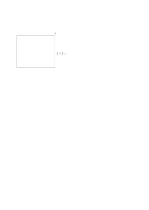

# JuliaTopOpt
Topology Optimization using Julia Programming language

<!---
# Matrices
We use xxx for regular matrices in concept testing but sparse matrices are used for production code.

# Method of introducing tables
| Syntax      | Description |
| ----------- | ----------- |
| Header      | Title       |
| Paragraph   | Text        |

# Example of LaTeX

--->

# top88_ES.jl Deconstruction
| Notes/Annotations |
| :---------------- |
| <ul><li>[a x b] – denoting dimension of array/matrix</li><li>dofs – degrees of freedom</li></ul> |

| Lines | Source Code | Description |
| :---: | :---------- | :---------- |
| 1-5   | using SparseArrays  using LinearAlgebra  using Statistics  using Printf  using Plots | Prepare the packages required for the operations |
| 7     | function top88(nelx,nely,volfrac,penal,rmin,ft) | Main function call  Inputs:<ul><li>nelx – no. of elements in x direction</li><li>nely – no. of elements in y direction</li><li>volfrac – volume fraction</li><li>penal – penalisation factor</li><li>rmin – filter radius</li><li>ft – filtering mode (1: Sensitivity filtering, 2: Density Filtering)</li></ul> |
| 9-11  | E0 = 1  Emin = 1e-9  nu = 0.3 | Setting material properties:<ul><li>E0 – Nominal Stiffness</li><li>Emin – Small non-zero stiffness to avoid singular matrices</li><li>nu – Poisson’s ratio</li></ul> |
| 13-16 | A11 = [12  3 -6 -3;  3 12  3  0; -6  3 12 -3; -3  0 -3 12]  A12 = [-6 -3  0  3; -3 -6 -3 -6;  0 -3 -6  3;  3 -6  3 -6]  B11 = [-4  3 -2  9;  3 -4 -9  4; -2 -9 -4 -3;  9  4 -3 -4]  B12 = [ 2 -3  4 -9; -3  2  9 -2;  4  9  2  3; -9 -2  3  2] | Preparing matrix components that comprise the element stiffness matrix for 2D 4-noded bilinear elements in plane stress |
| 17    | KE = 1/(1-nu^2)/24\*([A11 A12;A12' A11]+nu\*[B11 B12;B12' B11]) | Assembly of the element stiffness matrix [8 x 8] |
| 18    | nodenrs = reshape(1:(1+nelx)\*(1+nely),1+nely,1+nelx) | Create global node numbers matrix, column-major convention: top down, starting from leftmost column  [nely+1 x nelx+1] |
| 19    | edofVec = reshape(2\*nodenrs[1:end-1,1:end-1].+1,nelx\*nely,1) | Create 1D array of leading dofs for each element in edofMat (x-direction dof for the bottom left node for each element)  [nelx\*nely x 1] |
| 20    | edofMat = repeat(edofVec,1,8)+repeat([0 1 2\*nely.+[2 3 0 1] -2 -1],nelx\*nely,1) | Create element dof matrix, where each row notates the global dof number for each element with convention: starting from the bottom left x-direction dof, then y-direction dof, going anticlockwise for each element, (steering matrix)  [nelx\*nely x 8] |
| 21-22 | iK = reshape(kron(edofMat,ones(Int,8,1))',64\*nelx\*nely,1)  jK = reshape(kron(edofMat,ones(Int,1,8))',64\*nelx\*nely,1) | Preparing index vectors for sparse function to construct global stiffness matrix  [64\*nelx\*nely x 1] |
| 24    | F = sparse([2],[1],[-1],2\*(nely+1)\*(nelx+1),1) | Applying load of -1 at global dof 2 (therefore for top left node of elemement 1 in y-direction)  [2\*(nelx+1)\*(nely+1) x 1] |
| 25    | U = zeros(2\*(nely+1)\*(nelx+1),1) | Initialise global displacement vector with 0s  [2\*(nelx+1)\*(nely+1) x 1] |
| 26    | fixeddofs = union(collect(1:2:2\*(nely+1)),[2\*(nelx+1)\*(nely+1)]) | 1D array of fixed dofs, (For MBB beam, fixed x-displacements for left side nodes due to symmetry condition and fixed y-displacement for bottom right corner node due to fixed support) |
| 27    | alldofs = collect(1:2\*(nelx+1)\*(nely+1)) | 1D array of all global dofs  [2\*(nelx+1)\*(nely+1) element array] |
| 28    | freedofs = setdiff(alldofs,fixeddofs) | 1D array of remaining free dofs |
| 30-32 | iH = ones(Int,nelx\*nely\*(2\*(ceil(Int,rmin)-1)+1)^2,1)  jH = ones(Int,size(iH))  sH = zeros(size(iH)) | Initialise index vectors for creating the filter weight matrix (H, which is a collection of all values of Hei) using the sparse function  [nelx\*nely x 1] |
| 33    | k = 0 | Initialise counter for filter weight matrix construction |
| 34    | for i1 in 1:nelx | For i1 = 1, 2, ... , nelx |
| 35    | &nbsp;&nbsp;&nbsp;&nbsp;for j1 in 1:nely | For j1 = 1, 2, ... , nely (therefore, sampling through every element in the mesh) |
| 36    | &nbsp;&nbsp;&nbsp;&nbsp;&nbsp;&nbsp;&nbsp;&nbsp;e1 = (i1-1)\*nely+j1 | Element 1 (element e) number |
| 37-38 | &nbsp;&nbsp;&nbsp;&nbsp;&nbsp;&nbsp;&nbsp;&nbsp;for i2 in max(i1-(ceil(rmin)-1),1):min(i1+(ceil(rmin)-1),nelx) &nbsp;&nbsp;&nbsp;&nbsp;&nbsp;&nbsp;&nbsp;&nbsp;&nbsp;&nbsp;&nbsp;&nbsp;for j2 in max(j1-(ceil(rmin)-1),1):min(j1+(ceil(rmin)-1),nely) | for all elements which the centre-to-centre distance to element e is smaller than the filter radius |
| 39    | &nbsp;&nbsp;&nbsp;&nbsp;&nbsp;&nbsp;&nbsp;&nbsp;&nbsp;&nbsp;&nbsp;&nbsp;&nbsp;&nbsp;&nbsp;&nbsp;e2 = (i2-1)\*nely+j2 | Element 2 (element i) number |
| 40    | &nbsp;&nbsp;&nbsp;&nbsp;&nbsp;&nbsp;&nbsp;&nbsp;&nbsp;&nbsp;&nbsp;&nbsp;&nbsp;&nbsp;&nbsp;&nbsp;k = k+1 | Increment counter |
| 41    | &nbsp;&nbsp;&nbsp;&nbsp;&nbsp;&nbsp;&nbsp;&nbsp;&nbsp;&nbsp;&nbsp;&nbsp;&nbsp;&nbsp;&nbsp;&nbsp;iH[k] = e1 | Place element 1 number in iH |
| 42    | &nbsp;&nbsp;&nbsp;&nbsp;&nbsp;&nbsp;&nbsp;&nbsp;&nbsp;&nbsp;&nbsp;&nbsp;&nbsp;&nbsp;&nbsp;&nbsp;jH[k] = e2 | Place element 2 number in jH |
| 43    | &nbsp;&nbsp;&nbsp;&nbsp;&nbsp;&nbsp;&nbsp;&nbsp;&nbsp;&nbsp;&nbsp;&nbsp;&nbsp;&nbsp;&nbsp;&nbsp;sH[k] = max(0,rmin-sqrt((i1-i2)^2+(j1-j2)^2)) | Place corresponding weight value, Hei in sH |
| 48    | H = sparse(vec(iH),vec(jH),vec(sH)) | Create filtering weight matrix using sparse function  [nelx\*nely x nelx\*nely] |
| 49    | Hs = sparse(sum(H,dims=2)) | Hs = column vector containing the sum of each row of the H matrix  [nelx\*nely x 1] |
| 51    | x = repeat([volfrac],nely,nelx) | Create matrix containing density values associated to each mesh cell  [nely x nelx] |
| 52    | xPhys = copy(x) | xPhys is a copy of x used to represent the physical mesh densities after filtering  [nely x nelx] |
| 53    | loop = 0 | Initialise loop count |
| 54    | change = 1 | Initialise change value |
| 56    | while change > 0.01 | Begin main while loop  The change value is defined as the L&infin; norm of the difference between the density matrix of the new iteration in vectorised form, xnew[:], and the density matrix of the current iteration in vectorised form, x[:], therefore the maximum absolute value within the vector components in xnew[:]-x[:] |
| 57    | loop = loop + 1 | Increment loop counter |
| 59    | sK = reshape(KE[:]\*(Emin.+xPhys[:]'.^penal\*(E0-Emin)),64\*nelx\*nely,1) | Global stiffness matrix entries after modifying the element stifnesses according to the modified SIMP formulation  [64\*nelx\*nely x 1] |
| 60    | K = sparse(vec(iK),vec(jK),vec(sK)); K = (K+K')/2 | Create the global stiffness matrix using the sparse function |
| 61    | U[freedofs] = cholesky(K[freedofs, freedofs])\Vector(F[freedofs]) | Solve the FEA stiffness equation for global dof displacements |
| 63    | ce = reshape(sum((U[edofMat]\*KE).\*U[edofMat],dims=2),nely,nelx) | Calculate element compliances |
| 64    | c = sum(sum((Emin.+xPhys.^penal\*(E0-Emin)).\*ce)) | Calculate the total compliance of the design |
| 65    | dc = -penal\*(E0-Emin)\*xPhys.^(penal-1).\*ce | Calculate compliance sensitivities for every element  [nely x nelx] |
| 66    | dv = ones(nely,nelx) | Volume sensitivities for every element (=1 by definition)  [nely x nelx] |
| 68    | if ft == 1 | If the sensitivity filter is selected |
| 69    | &nbsp;&nbsp;&nbsp;&nbsp;dc[:] = H\*(x[:].\*dc[:])./Hs./max.(fill(1e-3,size(x[:])),x[:]) | Modify the compliance sensitivity according to the sensitivity filter equation |
| 70    | elseif ft == 2 | If the density filter is selected |
| 71-72    | &nbsp;&nbsp;&nbsp;&nbsp;dc[:] = H\*(dc[:]./Hs) &nbsp;&nbsp;&nbsp;&nbsp;dv[:] = H\*(dv[:]./Hs) | Modify both the compliance and volume sensitivities according to the density filter (chain rule) equation |
| 75    | l1 = 0; l2 = 1e9; move = 0.2; xnew = zeros(nely,nelx) | Prepare lower and upper bound values for lambda used in the bisection method, the move limit, and initialise xnew with 0s |
| 76    | while (l2-l1)/(l1+l2) > 1e-3 | While the bisection method is not considered converged |
| 77    | &nbsp;&nbsp;&nbsp;&nbsp;lmid = 0.5*(l2+l1) | Calculate lmid, the average of l1 and l2 |
| 78    | &nbsp;&nbsp;&nbsp;&nbsp;xnew = max.(fill(0,nely,nelx),max.(x.-move,min.(fill(1,nely,nelx),min.(x.+move,x.\*sqrt.(-dc./dv/lmid))))) | Compute the density matrix for the next iteration from the Optimality Criteria method updating formulation (the three case conditional statements are combined into one line of code)  [nely x nelx] |
| 79    | &nbsp;&nbsp;&nbsp;&nbsp;if ft == 1 | If the sensitivity filter is selected |
| 80    | &nbsp;&nbsp;&nbsp;&nbsp;&nbsp;&nbsp;&nbsp;&nbsp;xPhys = xnew | xnew can be directly accepted as the physical solution for plotting, xPhys  [nely x nelx] |
| 81    | &nbsp;&nbsp;&nbsp;&nbsp;elseif ft == 2 | If the density filter is selected |
| 82    | &nbsp;&nbsp;&nbsp;&nbsp;&nbsp;&nbsp;&nbsp;&nbsp;xPhys[:] = (H\*xnew[:])./Hs | The densities are modified according to the density filter equation |
| 84    | &nbsp;&nbsp;&nbsp;&nbsp;if sum(xPhys[:]) > volfrac\*nelx\*nely; l1 = lmid; else l2 = lmid; end | Choose the next appropriate bounds for the bisection method |
| 86    | change = maximum(abs.(xnew[:]-x[:])) | Calculate the L&infin; norm |
| 87    | x = xnew | Prepare x for the next iteration |
| 89-90 | @printf(" It.:%5i Obj.:%11.4f Vol.:%7.3f ch.:%7.3f\n",loop,c, &nbsp;&nbsp;mean(xPhys[:]),change) | Print the iteration number, objective function (compliance) value, volume fraction (this should be unchanged throughout the optimisation process), and change = L&infin; norm |
| 92    | display(heatmap(xPhys, xlim=(0,nelx+1), ylim=(0,nely+1), color=:Greys, clims=(0,1), aspect_ratio=1, yflip=true)) | Plot the design (xPhys matrix) as a greyscale image |
| 94    | end | End function |

<!---
# Example of image insertion

*image_caption*

More text goes here ...
--->
